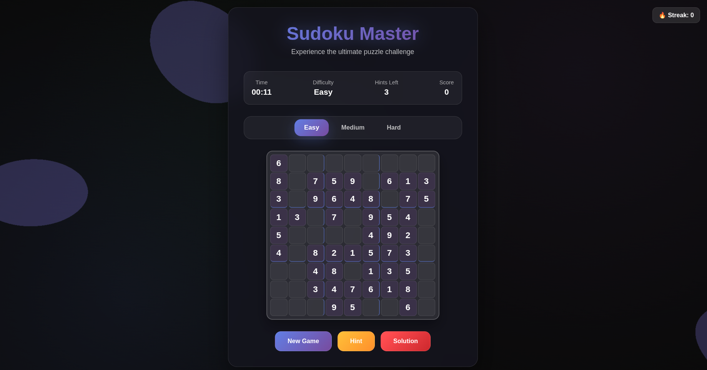
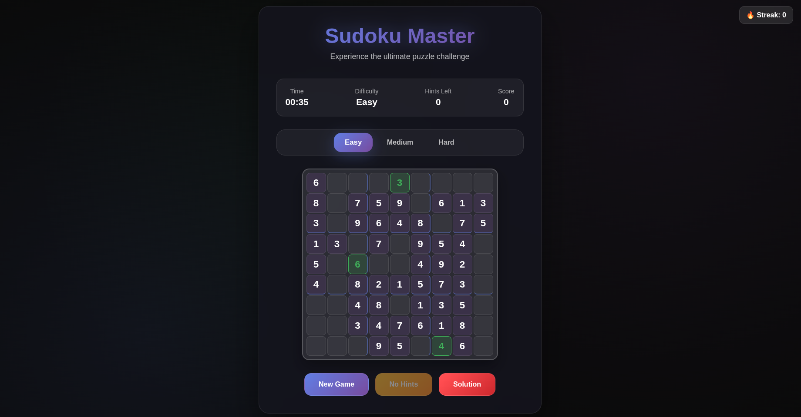
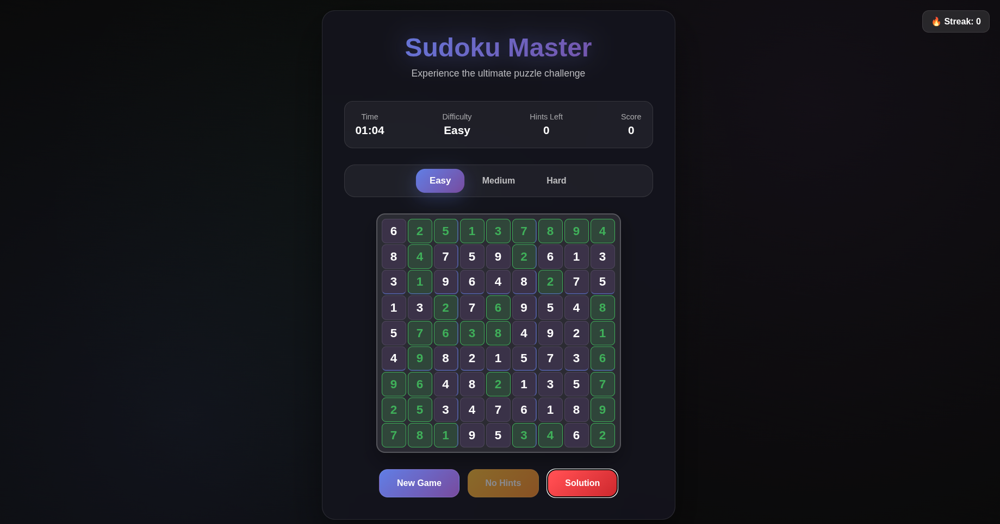
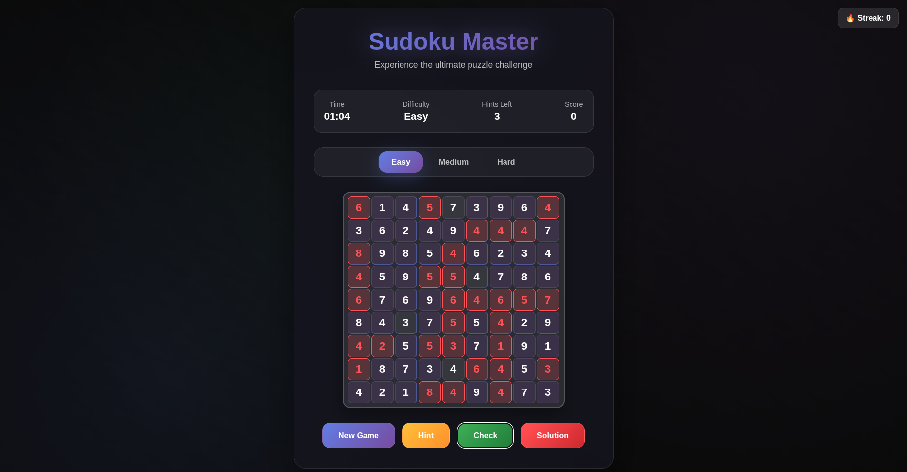

# 🎯 Modern Sudoku Master






A stunning, modern web-based Sudoku game featuring dynamic 3D backgrounds, glassmorphism UI, and advanced gameplay mechanics. Experience the classic puzzle with cutting-edge web technologies and immersive visual effects.

## ✨ Features

### 🎮 Game Mechanics
- **Three Difficulty Levels**: Easy (35 removed cells), Medium (45 removed cells), Hard (55 removed cells)
- **Smart Puzzle Generation**: Mathematically guaranteed unique solutions
- **Intelligent Hint System**: Context-aware hints with visual feedback
- **Real-time Validation**: Instant error detection and correction feedback
- **Auto-completion Detection**: Automatic puzzle completion recognition

### 🎨 Visual Experience
- **3D Animated Background**: Morphing gradient blobs with shader effects
- **Glassmorphism UI**: Modern frosted glass aesthetic with backdrop blur
- **Smooth Animations**: CSS3 transitions and keyframe animations
- **Visual Feedback System**: Error shaking, success pulsing, hint glowing
- **Responsive Design**: Optimized for desktop and mobile devices

### 🏆 Game Features
- **Scoring System**: Points based on difficulty and completion time
- **Streak Counter**: Track consecutive successful completions
- **Timer**: Real-time game duration tracking
- **Fireworks Celebration**: Animated success celebrations
- **Keyboard Navigation**: Arrow key grid navigation

## 🚀 Quick Start

### Prerequisites
- Modern web browser with WebGL support
- No additional installations required

### Installation
1. Clone the repository:
   ```bash
   git clone https://github.com/yourusername/sudoku.git
   cd sudoku
   ```

2. Open `index.html` in your web browser:
   ```bash
   # Using Python (if available)
   python -m http.server 8000
   
   # Or using Node.js
   npx http-server
   
   # Or simply open index.html directly in your browser
   ```

3. Start playing immediately! No setup required.

## 🎯 How to Play

### Basic Controls
- **Cell Selection**: Click on any empty cell or use arrow keys to navigate
- **Number Input**: Type numbers 1-9 to fill cells
- **Hint System**: Use the hint button for clues (limited per difficulty)
- **Solution Check**: Fill all cells and click "Check" to validate your solution

### Game Interface
- **Stats Bar**: Displays current time, difficulty, remaining hints, and score
- **Difficulty Selector**: Switch between Easy, Medium, and Hard modes
- **Control Buttons**: 
  - `New Game`: Generate a fresh puzzle
  - `Hint`: Get a helpful clue
  - `Check`: Validate your complete solution
  - `Solution`: Reveal the complete answer

### Scoring System
- **Base Points**: Easy (100), Medium (200), Hard (300)
- **Completion Bonus**: 10x base points for finishing
- **Streak Multiplier**: Consecutive wins increase your streak

## 🔧 Technical Architecture

### Core Technologies
- **Vanilla JavaScript (ES6+)**: Main game logic and DOM manipulation
- **Three.js (r128)**: 3D graphics and animations
- **CSS3**: Modern styling with custom properties and animations
- **HTML5**: Semantic structure and canvas integration

### Key Components

#### 1. ModernSudokuGame Class
```javascript
class ModernSudokuGame {
    constructor() {
        // Game state management
        // 3D background initialization
        // Event listener setup
    }
}
```

#### 2. Puzzle Generation Algorithm
- **Complete Grid Generation**: Fills diagonal 3x3 boxes first
- **Backtracking Solver**: Recursively solves remaining cells
- **Cell Removal**: Strategically removes cells based on difficulty
- **Validation**: Ensures unique solution exists

#### 3. 3D Background System
- **Morphing Geometry**: Dynamic sphere deformation using shaders
- **Gradient Materials**: Real-time color interpolation
- **Smooth Animation**: 60fps rendering with optimized performance
- **Responsive Canvas**: Automatic resize handling

#### 4. UI/UX Features
- **Glassmorphism Effects**: Backdrop blur and transparency
- **Micro-interactions**: Hover effects and button animations
- **Visual Feedback**: Color-coded cell states and animations
- **Accessibility**: Keyboard navigation and clear visual hierarchy

## 📁 Project Structure

```
modern-sudoku-master/
├── index.html              # Main HTML structure
├── styles.css              # Complete styling and animations
├── script.js               # Game logic and Three.js integration
├── README.md              # This file
└── assets/                # Additional resources (if any)
    └── screenshots/       # Game screenshots
```

## 🎨 Customization

### Difficulty Modification
Adjust cell removal counts in the `generatePuzzle()` method:
```javascript
const cellsToRemove = {
    easy: 35,     // Modify for easier/harder
    medium: 45,   // Adjust medium difficulty
    hard: 55      // Change hard difficulty
};
```

### Visual Themes
Modify CSS custom properties for quick theme changes:
```css
:root {
    --primary-gradient: linear-gradient(135deg, #667eea 0%, #764ba2 100%);
    --glass-background: rgba(20, 20, 30, 0.85);
    --accent-color: #667eea;
}
```

### 3D Background Effects
Customize blob behavior in `initializeBackground()`:
```javascript
const blobCount = 6;        // Number of animated blobs
const speed = 0.02;         // Animation speed
const amplitude = 2;        // Movement range
```

## 🚀 Performance Optimizations

- **Efficient Rendering**: Three.js scene optimization for smooth 60fps
- **Memory Management**: Proper cleanup of intervals and event listeners
- **CSS Transforms**: Hardware-accelerated animations
- **Debounced Events**: Optimized input handling
- **Responsive Images**: Scalable vector graphics where possible

## 🌐 Browser Compatibility

| Browser | Version | Support |
|---------|---------|---------|
| Chrome  | 60+     | ✅ Full |
| Firefox | 55+     | ✅ Full |
| Safari  | 12+     | ✅ Full |
| Edge    | 79+     | ✅ Full |
| Mobile  | Modern  | ✅ Full |

## 🤝 Contributing

Contributions are welcome! Please feel free to submit a Pull Request. For major changes, please open an issue first to discuss what you would like to change.

### Development Setup
1. Fork the repository
2. Create a feature branch: `git checkout -b feature/amazing-feature`
3. Commit your changes: `git commit -m 'Add amazing feature'`
4. Push to the branch: `git push origin feature/amazing-feature`
5. Open a Pull Request

### Coding Standards
- Use ES6+ features where appropriate
- Follow consistent naming conventions
- Comment complex algorithms
- Maintain responsive design principles

## 📝 License

This project is licensed under the MIT License - see the [LICENSE](LICENSE) file for details.

## 🎯 Future Enhancements

- [ ] **Multiplayer Mode**: Real-time collaborative solving
- [ ] **Daily Challenges**: New puzzles with special rewards
- [ ] **Achievement System**: Unlock badges and milestones
- [ ] **Puzzle Import/Export**: Custom puzzle sharing
- [ ] **Advanced Statistics**: Detailed gameplay analytics
- [ ] **Mobile App**: Native iOS/Android versions
- [ ] **Accessibility Features**: Screen reader support, high contrast mode

## 🙏 Acknowledgments

- **Three.js Community**: For the amazing 3D graphics library
- **Sudoku Algorithm**: Based on backtracking and constraint satisfaction
- **Modern CSS**: Inspired by current glassmorphism design trends
- **Web APIs**: Utilizing cutting-edge browser capabilities

## 📧 Support

If you encounter any issues or have questions:
- 🐛 **Bug Reports**: Open an issue on GitHub
- 💡 **Feature Requests**: Submit enhancement proposals
- 📚 **Documentation**: Check the wiki for detailed guides
- 💬 **Community**: Join our Discord server for discussions

---

<div align="center">

**Made with ❤️ and modern web technologies**

[Live Demo](https://your-demo-url.com) • [Report Bug](https://github.com/yourusername/modern-sudoku-master/issues) • [Request Feature](https://github.com/yourusername/modern-sudoku-master/issues)

</div>
